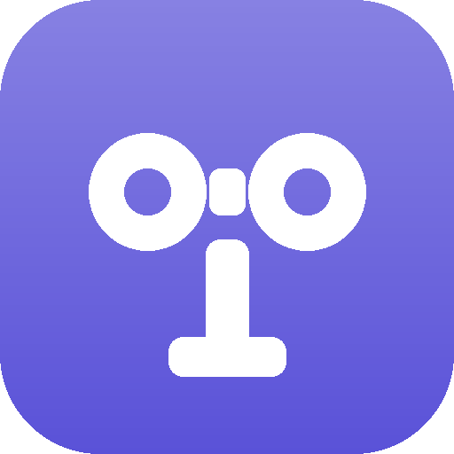
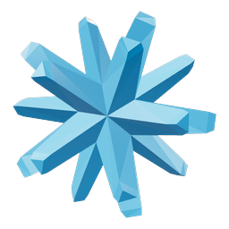

# Harness

Agents that build things, in one window. Code with Claude Code, Codex, Cursor and eleven more. CAD
with Toymaker and text-to-cad. PCBs with Copper. Keynotes with Marp. Every agent runs in a persistent terminal on
any machine you own, and the domains beyond code get a viewer beside it that shows the work as it
is made.

<p align="center">
  
</p>

## One app, every agent

An agent is the who: Claude Code, Codex, Cursor and eleven more for code, and the specialized ones,
Toymaker, Copper and Marp, each an agent plus the skills, toolchain and viewer of its domain. Harness
never wraps an agent; it reads the transcript each one already writes and installs the vendor's own
hooks, so your credentials stay in your `~/.claude`, `~/.codex`, and so on. A harness is one
session of an agent running somewhere: a machine, a project, a pane, and for the domains beyond
code, the viewer beside it. Pick an agent, and yours is a git repository away.

| Category | Agents |
|---|---|
| **Code** |  Claude Code &nbsp;&nbsp;  Codex &nbsp;&nbsp;  Cursor &nbsp;&nbsp;  OpenCode &nbsp;&nbsp;  Pi &nbsp;&nbsp;  Hermes &nbsp;&nbsp;  Command Code &nbsp;&nbsp;  Devin &nbsp;&nbsp;  Muse Code &nbsp;&nbsp;  Amp &nbsp;&nbsp;  Kilo &nbsp;&nbsp;  Grok &nbsp;&nbsp;  Antigravity &nbsp;&nbsp;  GitHub Copilot |
| **CAD** |  Toymaker &nbsp;&nbsp;  text-to-cad, by Jake Fitzgerald |
| **PCB** |  Copper |
| **Slides** |  Marp |

## Every machine you own

Your laptop, the Mac mini at home, the box in the rack, in one window, side by side. Each machine
runs a small daemon that dials out; nothing to open, no SSH, no VPN. The relay in between forwards
ciphertext and holds no keys, and terminal traffic goes machine to machine over WebRTC when it can.

Sessions live on the machine, not in the window. Every agent is a tmux pane there. Close the laptop,
open it on the train: same pane, same scrollback. After a reboot the daemon brings each agent back
with the engine's own `--resume` and the same id. Start an agent on another machine by browsing its
folders from New Harness, or clone a repository there first.

<p align="center">
  
</p>

## A device for the desk

A round USB display with a microphone. Your agents are tiles in the order of the window's panes,
each with what it is doing and for how long. When an agent asks a question, it is on the face,
answerable with a tap. When a turn finishes, the recap, with one quiet tone. Double-tap and speak, and
Boss mode routes the task to the agent already on it. No WiFi, no credential: plugging it in is the
authorization, and the daemon on that computer serves it over the cable.

https://github.com/user-attachments/assets/97848065-61c6-40df-be66-a8247f69aa4c

## Install

1. **The app**, macOS 12+ or Ubuntu 22.04+: [harness.autonomous.ai/desktop](https://harness.autonomous.ai/desktop).
2. **Another machine**, a server, a Mac mini, a container, with Node ≥ 20 and tmux:

   ```bash
   curl -fsSL https://harness.autonomous.ai/cli/install.sh | bash
   harness login
   harness start
   ```

   It shows up in the app within a minute.

## First five minutes

- **⌘N** New Harness: an agent, a machine, a folder, Create.
- **⌘O** Open Harness: find any session, tab, project or machine; `>` runs a command.
- **⌘B** takes a task in plain words and routes it to the agent already on it.
- **⌘R** and **⌘D** split right and down.
- **⌘S** picks a layout.
- **⌘⏎** zooms a pane.
- **⇧⌘I** lists the agents waiting on you.

The full keymap, and how to remap it: [docs/keyboard.md](docs/keyboard.md). The window in detail:
[docs/app.md](docs/app.md).

## Extend and contribute

Every layer has a contract, a starter and a check, and most ways in never touch this repo's code.

| You could | Start at | The bar |
|---|---|---|
| **Build a harness** for your domain, or bring your own project in | [`dsh/README.md`](dsh/README.md), [`dsh/starter-dsh/`](dsh/starter-dsh/), then a file in [`dsh/registry/`](dsh/registry/) | `harness dsh check .` green; an afternoon from the starter. Marp and text-to-cad are wrappers Autonomous wrote to show the shape; their maintainers can take them over |
| **Bring your agent** as a CLI engine | [`cli/src/engines/README.md`](cli/src/engines/README.md) | a recorded session of the real binary; the fixtures pass |
| **Bring your agent** as an API provider | [`provider/README.md`](provider/README.md) | eight JSON-RPC methods; the conformance runner, zero failures |
| **A terminal multiplexer** | [CONTRIBUTING.md](CONTRIBUTING.md#adding-a-multiplexer) | `npm run test:tmux-real`; open an issue first |
| **A palette or terminal theme** | [`docs/extending.md`](docs/extending.md#palettes-and-appearance) | one Dart value; `flutter test` |
| **A keymap** | `~/.config/harness/keybindings.jsonc` | no code; it reloads on save |
| **Automation** over the daemon | [`docs/cli.md`](docs/cli.md#automation) | the loopback socket answers |
| **A bug report** | an issue | an engine bug is fixed from a real transcript; attach one and it is half done |
| **Docs** | this file and [`docs/`](docs/) | what confused you in the first five minutes is the next fix |

A domain harness is a git repository: a manifest, an `AGENTS.md`, skills, a workspace template, a
toolchain that installs itself, and for the pane a viewer server and a verdict file. Harness reads
the manifest and nothing else. Copy the starter, `harness dsh check .`, `harness dsh install . --link`,
and your tile is in New Harness. [Marp](https://github.com/autonomous-ai/autonomous-marp) is the
smallest complete one and the place to start.

[CONTRIBUTING.md](CONTRIBUTING.md) has the workflow, [SECURITY.md](SECURITY.md) takes security
reports, and the licence is [MIT](LICENSE).

## Docs

- [docs/app.md](docs/app.md) — sessions, panes, layouts, terminal, attention, machines
- [docs/keyboard.md](docs/keyboard.md) — the full keymap and the keymap file
- [docs/engines.md](docs/engines.md) — the fourteen engines: how each is followed, resume, bypass, grids
- [docs/architecture.md](docs/architecture.md) — daemon, session model, transport and encryption, relay, providers, the device
- [docs/cli.md](docs/cli.md) — every `harness` command, the dashboard, the loopback socket
- [docs/extending.md](docs/extending.md) — agents, multiplexers, palettes, keys, automation
- [docs/development.md](docs/development.md) — repository layout, build, test, release
- [dsh/README.md](dsh/README.md) — build a domain harness; [dsh/spec/](dsh/spec/README.md) is the contract
- [cli/](cli/README.md), [desktop/](desktop/README.md), [backend/](backend/README.md), [provider/](provider/README.md) — per-package detail
