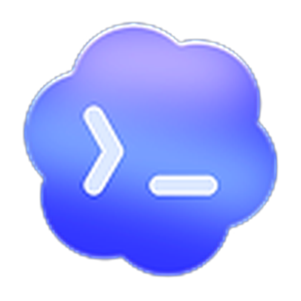
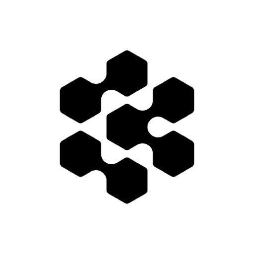
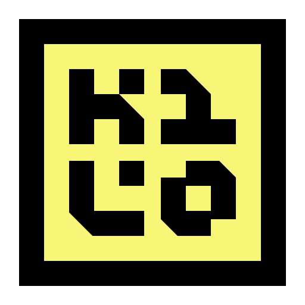

https://github.com/user-attachments/assets/97848065-61c6-40df-be66-a8247f69aa4c

# Autonomous Harness

**The way we use computers changed. The hardware didn't.**

Mouse and keyboard assume your hands are on the work — you type the character, you drag the file, you
click the button. That held for forty years. It stopped about two years ago: most of what you ship
now, you described and an agent wrote. Your input became intent, target and judgment.

Your desk never caught up. So your agents live in two tmux panes, a browser tab, and a server you
keep forgetting about, and you alt-tab around to find the one that finished.

**[Harness](https://www.autonomous.ai/harness) is the device for that.** Keyboard in the middle,
mouse on the right, Harness on the left. Say one sentence and the work goes to whichever machine that
agent lives on. The screen shows all of them at once.

It drives the agents you already use:

<p align="center">
  
  &nbsp;&nbsp;
  
  &nbsp;&nbsp;
  
  &nbsp;&nbsp;
  
  &nbsp;&nbsp;
  
  &nbsp;&nbsp;
  
  &nbsp;&nbsp;
  
  &nbsp;&nbsp;
  
  &nbsp;&nbsp;
  
  &nbsp;&nbsp;
  
  &nbsp;&nbsp;
  
  &nbsp;&nbsp;
  
  &nbsp;&nbsp;
  
  &nbsp;&nbsp;
  
</p>

## Add your agent to Harness

Two ways to integrate. We support both **CLI** and **API**.

|  | **CLI** | **API** |
|---|---|---|
| **Your agent is** | a command you run — laptop, server, anywhere | a service on your own infrastructure |
| **You write** | a normalizer, in TypeScript, here | an HTTP endpoint, in any language |
| **You ship it** | as a pull request to this repo | by deploying it yourself |
| **Start at** | [`cli/src/engines/`](cli/src/engines/README.md) | [`provider/`](provider/README.md) |

To get started, run this:

```bash
curl -fsSL https://harness.autonomous.ai/install.sh | bash -s -- <token>
harness join
```

In the code these are named `engine` (CLI) and `provider` (API) — the folder names you'll see:

```bash
# CLI — typecheck and replay the recorded-session fixtures
cd cli && npm install && npm run typecheck && npm test

# API — run the reference implementation, then check your endpoint against it
cd provider/reference-provider && npm install && npm run dev
npm run conformance -- --url https://your-endpoint --key <credential>
```

## Harness architecture

Your agents stay your processes, on your hardware, with your credentials.

```
                                ( ◉ )   Harness
                                  │
                        ╔═════════╧═════════╗
                        ║   Harness Relay   ║   end-to-end encrypted
                        ╚═════════╤═════════╝
          ┌───────────────────────┼───────────────────────┐
          │                       │                       │
     your laptop             your server            your platform
    `harness join`          `harness join`          your HTTP API
          │                       │                       │
     claude · codex          hermes · muse           agents running on
     cursor · amp · …        opencode · kilo ·       your own servers
                             grok · agy · copilot

          └───────── CLI ─────────┘             └─────── API ───────┘
```

## End-to-end encryption

On the CLI path it's always on — there's no switch for it. Everything between your machines and the
device is ciphertext by the time it reaches us.

- **Ed25519** identity keys, pinned at first pairing and signing every ephemeral after it.
- A **CPace-style PAKE** over ristretto255 — the six-character pairing code bootstraps a shared
  secret across the untrusted relay, and an attacker gets **one online guess**. There's no offline
  attack on it.
- **X25519** ephemeral Diffie–Hellman per connection, through HKDF to pairwise session keys.
- A **per-process group key** so one event encrypts once for many readers, carrying its own epoch id.
- **ChaCha20-Poly1305** on every frame, with the associated data binding the frame's type and
  session, so a frame can't be replayed into a context it wasn't written for.

Harness Relay stores and forwards. It holds no key material, so it can't read a prompt, a diff, a
result, or the name of what you're working on.

The crypto core is a byte-identical twin of the browser's copy, with a drift-guard test that fails if
the two ever diverge, and committed self-vectors that catch a crypto library changing underneath it.
The code is in [`cli/src/lib/e2ee/`](cli/src/lib/e2ee/).

## How to contribute

Harness welcomes two kinds of CLI integration. Open an issue before writing code so we can confirm
the integration shape and the real software a maintainer will need to reproduce it. The complete
review and pull-request workflow is in [CONTRIBUTING.md](CONTRIBUTING.md).

### 1. Add an agent framework

To add an agent CLI such as Claude Code or Grok, start by recording a real session from the real
binary. The recording is the source of truth for transcript fields, event names, tools, turn
boundaries, model metadata and capabilities — do not infer them from another engine.

An engine contribution covers process detection, session discovery, transcript reading and event
normalization, prompt/control behavior, product surfaces, and replay fixtures. Follow
[`cli/src/engines/README.md`](cli/src/engines/README.md) for the dependency-ordered checklist, then
run:

```bash
cd cli && npm install && npm run typecheck && npm test
```

### 2. Add a terminal multiplexer

Harness watches tmux and Herdr 0.8.x protocol 19 together, with nothing to configure: whichever is
installed is used, and `tmux new` then an engine and `herdr` then the same engine both produce an agent.
Another multiplexer must be added alongside them, not replace them. Before coding, confirm that a
process inside a pane can identify that pane with a stable, multiplexer-namespaced id — and that your
tool's presence can be detected without running it, since a machine that does not have it must pay
nothing. The integration must support listing panes with their PID and working directory, sending
literal text and keys, capturing pane output, displaying a message, and creating and killing sessions.

The contribution must also carry the new pane identity through process discovery, registry
persistence and hooks, and scrub it from recap workers so they cannot register as phantom agents.
See [Adding a multiplexer](CONTRIBUTING.md#adding-a-multiplexer) for the compatibility requirements,
then run the normal CLI checks plus the real multiplexer discovery suite:

```bash
cd cli && npm install && npm run typecheck && npm test
npm run test:tmux-real
npm run test:herdr-real
```

## Security and licence

- Security reports go to [SECURITY.md](SECURITY.md) rather than the issue tracker.
- [MIT](LICENSE).
