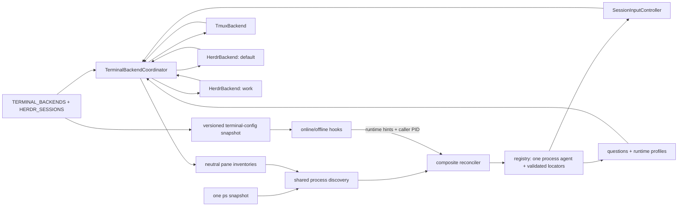
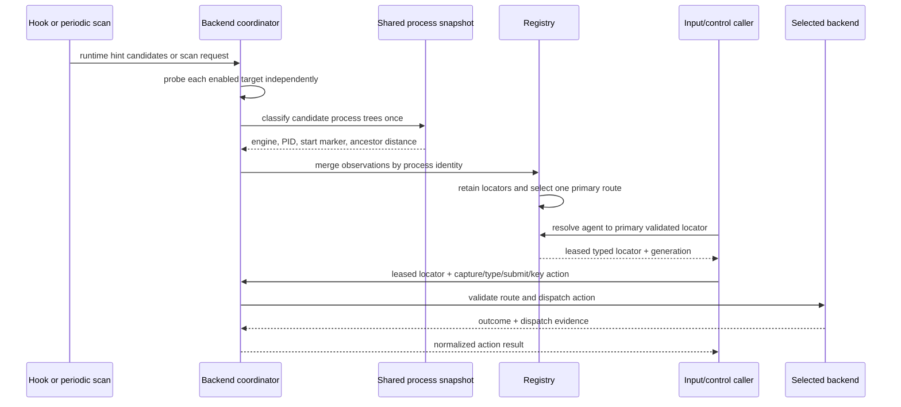

# feat: selectable tmux and Herdr terminal backends

Add Herdr 0.8.x as a fully supported terminal backend beside tmux. tmux remains the default; operators can enable tmux, Herdr, or both. The implementation introduces backend-neutral runtime identity, discovery, input, capture, validation, and hook handling without changing the transcript/event pipeline or requiring a private Herdr-only fork.

This plan supersedes the architecture—but not the research—in [`2026-08-11-herdr-runtime-fork.md`](./2026-08-11-herdr-runtime-fork.md). That document is preserved as historical context. Its verified Herdr findings remain useful; its “replace tmux” product decision does not.

---

## Goal Capsule

- **Objective:** Make the terminal multiplexer an additive, configured capability. Existing tmux users upgrade without behavior or identity loss; Herdr users receive equivalent discovery, remote input, terminal inspection, lifecycle validation, and supported-engine behavior.
- **Authority:** This plan; current upstream [`CONTRIBUTING.md`](../../CONTRIBUTING.md) and [`cli/src/engines/README.md`](../../cli/src/engines/README.md); recorded behavior from real tmux and Herdr 0.8.x binaries; then implementer judgment for non-contractual details.
- **Execution profile:** Obtain owner approval before publishing the required upstream design issue or any PR. Run U1’s isolated API spike first, then complete U2–U9 locally while keeping every automated gate green; attach U1/U9 evidence and obtain maintainer direction before any implementation lands upstream. Do not merge Herdr behavior based only on mocks; U1 requires real transport/identity/input evidence and U9 requires the full real-multiplexer matrix.
- **Stop conditions:** Stop before broad implementation only if Herdr’s versioned socket API cannot expose endpoint-scoped pane identity, cannot carry long/multiline text without argv/log exposure, cannot preserve exact-once-aware dispatch semantics, or cannot distinguish unavailable from a successful empty inventory. Missing third-party engine credentials or individual parser captures do not stop U2–U8; they remain explicit U9 release-evidence blockers. Stop an individual reconciliation cycle—not the daemon—when a configured backend or process-table probe is unavailable.
- **Tail ownership:** The implementation owner records any divergence from a KTD in the upstream issue/PR. Deferred wire renames and future multiplexer backends remain separate follow-up work.
- **Definition of done:** See `## Definition of Done`.

---

## Product Contract

### Summary

Harness currently treats tmux as both a command runner and part of persisted agent identity. The direct tmux command surface is small, but `tmuxPane` and `TMUX_PANE` flow through the registry, process discovery, online and offline hooks, one-shot isolation, input controllers, status payloads, and UI-driving code. Herdr 0.8.x exposes the required pane, process, input, capture, lifecycle, and local-socket APIs, but its identity model differs: a `terminal_id` survives pane moves while a public pane ID is only a mutable route, and pane IDs are unique only inside one Herdr session/endpoint.

The feature therefore adds a shared terminal-backend boundary and migrates identity rather than transliterating tmux commands into Herdr commands.

### Problem Frame

- Replacing tmux outright violates current upstream contribution guidance and would orphan existing users’ persisted agents.
- Reusing a string called `tmuxPane` for Herdr would hide endpoint collisions and pane-move semantics.
- Treating Herdr `terminal_id` as the whole agent identity would incorrectly reuse an `agentId` when an engine process exits and a new process starts in the same terminal.
- Treating transport errors as proof of death would evict live agents during load spikes, server restarts, or CLI/API timeouts.
- Treating text insertion as submission can swallow Enter, split multiline payloads, or duplicate a prompt after an ambiguous transport response.
- Hooks and recap workers must identify or deliberately erase terminal context for both backends, including the dependency-free daemon-down fallback.

### Actors

- **Operator:** Configures enabled terminal backends and optional Herdr named sessions, then starts supported agent CLIs in tmux and/or Herdr.
- **Harness daemon:** Discovers processes, binds engine sessions, drives terminal UI, and persists backend-neutral runtime state.
- **Engine process:** The authoritative lifetime of one visible agent. Its session/transcript may rotate underneath it.
- **Engine hook/plugin:** Supplies session metadata and a terminal-location hint; it never owns process identity.
- **tmux server / Herdr server:** Own terminal routes and I/O. Each server can be unavailable independently.
- **Web/device client:** Addresses stable Harness `agentId` values and must not need to understand terminal backend details.

### Requirements

- **R1 — Additive configuration.** `TERMINAL_BACKENDS` is a strict comma-separated list supporting `tmux`, `herdr`, and `tmux,herdr`; the default is `tmux`. Unknown or empty values fail startup with an actionable error.
- **R2 — Named Herdr targets.** When Herdr is enabled, Harness connects only to configured named Herdr sessions. `HERDR_SESSIONS` defaults to `default`; an explicit ordered list enables additional sessions and supplies deterministic tie-breaking. Two Herdr sessions may expose the same public pane ID without collision.
- **R3 — Backend-neutral locator model.** Persist one or more discriminated terminal runtime locators on each process-owned agent. tmux retains its pane route; Herdr persists a canonical endpoint/session identity, stable `terminal_id`, and current pane route. No backend-neutral API or registry index is named `tmuxPane`.
- **R4 — Process-authoritative identity and cross-backend deduplication.** The process identity `(engine, pid, start marker)` remains authoritative. One process visible through nested/coexisting multiplexers produces one `agentId` with multiple validated locators and one deterministic primary control route. A Herdr pane move preserves the `agentId`; a different engine process in the same `terminal_id` creates a replacement agent.
- **R5 — Upgrade- and rollback-safe persistence.** Existing `registry.json` records containing `tmuxPane` load as tmux runtime locators without changing `agentId`, engine-session bindings, names, or timestamps. The new runtime model is authoritative, but tmux rows retain an additive legacy `tmuxPane` projection for a compatibility release so rollback does not orphan tmux agents. Records with no currently enabled/healthy locator are preserved but not advertised as active.
- **R6 — Discovery parity.** All engines currently supported by `cli/src/lib/tmuxAgentDiscovery.ts` remain discoverable under tmux and Herdr. One reconciliation cycle reads the OS process table once, treats backend pane inventories as roots/hints, merges observations by process identity, and preserves shallowest-process ownership, ambiguity handling, resume-ID recovery, daemon-descendant exclusion, deletion suppression, and two-confirmed-miss removal.
- **R7 — Independent failure domains.** One backend or Herdr endpoint failing does not block successful discovery from another. Failed or timed-out probes produce `unknown` and cannot increment miss counts or evict agents.
- **R8 — Hook parity and trust boundary.** New hooks/plugins derive zero or more typed terminal hints plus a non-authoritative caller-PID hint from tmux and Herdr context. Every mutating loopback hook request also authenticates with a rotatable per-install high-entropy credential that is stored mode `0600`, never exposed through argv/logs, and verified in constant time; authenticated events are bound to the registered session/process identity. The daemon accepts legacy tmux payload shapes only over this authenticated channel, resolves hints only against configured backend inventory, and verifies the caller PID as the expected engine process or descendant in the authoritative process snapshot. Nested contexts are deduplicated rather than resolved by environment-variable priority. A stale route with no verified caller correlation fails closed, and a hook cannot make Harness connect to an arbitrary socket path.
- **R9 — Offline fallback parity.** `cli/hook/notify.mjs` can register a top-level engine safely while the daemon is down for both backends, using the same registry schema, process validation, and an atomically persisted non-secret snapshot of resolved backend configuration. Before the first valid snapshot—or when the relevant endpoint/caller cannot be verified—Herdr fallback skips registration rather than guessing; legacy tmux fallback remains compatible.
- **R10 — One-shot isolation.** Every recap/voice/summary child strips tmux and Herdr location variables before spawning so the child cannot become a phantom top-level agent or pollute multiplexer-native agent detection.
- **R11 — Exact-once-aware input.** The backend contract distinguishes literal typing, text submission, and logical key presses. Submission strips trailing newlines, preserves multiline content, and returns both outcome and dispatch evidence. Side-effecting failover is allowed only when execution is known not to have started; ambiguous completion is never blindly retried.
- **R12 — Capture and control parity.** Herdr capture preserves ANSI style, joins soft wraps, bounds history, and supplies enough current UI for question dialogs, idle/draft detection, model/effort/profile pickers, Cursor composer clearing, and title sync. Parser behavior remains engine-specific rather than backend-specific.
- **R13 — Safe lifecycle.** Validation is three-valued (`alive`, `gone`, `unknown`). Deleting an agent continues to signal only the validated engine process; neither backend closes a user-owned pane as part of agent deletion.
- **R14 — Compatibility.** Web/device agent identity and transcript/provider protocols do not change. During a compatibility window, outbound project/status payloads retain `tmuxPane` for tmux records and add optional backend-neutral terminal metadata; new Herdr records never masquerade as tmux panes.
- **R15 — Observability.** Logs and local status identify the backend and configured Herdr session without printing arbitrary socket paths or treating notification/event loss as liveness proof. Startup reports disabled, unavailable, and protocol-incompatible targets distinctly.
- **R16 — Verified operation.** The default suite runs without tmux or Herdr installed. Opt-in real suites cover both backends. Herdr support is pinned initially to the verified 0.8.x schema/protocol and degrades safely on mismatch.

### User and System Flows

#### F1 — Startup and discovery

1. Parse enabled backends and configured Herdr sessions.
2. Build one backend instance for the single supported default tmux server and one per configured Herdr session endpoint.
3. Load and migrate registry records without dropping disabled-backend state.
4. Probe enabled backends independently and read one shared process snapshot.
5. Match supported engine processes beneath each terminal root and merge duplicate observations by `(engine, pid, start marker)`.
6. Adopt, refresh, replace, or suppress process agents while attaching all validated locators and selecting one primary control route.
7. Publish only verified active agents to web/device clients.

#### F2 — Hook registration

1. An engine hook reads tmux and/or Herdr context from its environment and posts typed terminal hints, session metadata, and a caller PID hint (`process.pid`, `process.ppid`, or shell `PPID` according to the hook shape) over the authenticated per-install hook channel.
2. The daemon applies strict request-size/schema bounds, verifies the hook credential in constant time, normalizes legacy and new payloads, and treats caller PID as untrusted input.
3. Configured backends resolve live or aliased routes; for Herdr this adds `terminal_id` and the current route.
4. Process discovery verifies the caller PID as the supported engine process or its expected descendant/ancestor chain, verifies the event session is already bound or eligible to bind to that process, and binds it to exactly one scanner-owned process identity.
5. The registry binds the engine session to that one process agent, attaching any additional validated locators instead of minting duplicates. A stale/ambiguous route without caller correlation is rejected.
6. If the daemon is down, `notify.mjs` reads the last atomically persisted backend snapshot and performs the same verification under the existing registry lock, or skips safely.

#### F3 — Remote message and terminal control

1. A web/device message resolves to a Harness `agentId`, then its deterministic primary validated terminal locator.
2. Locator validation returns `alive`, `gone`, or `unknown`; another healthy locator may become primary before dispatch, and a multi-step control acquires a locator-generation lease.
3. The selected backend submits the text with one submission action and reports whether PTY execution was impossible, rejected, executed, or ambiguous.
4. `SessionInputController` observes transcript/pane evidence before any follow-up key action; ambiguous dispatch never fails over blindly.
5. Question and profile controllers use backend-neutral capture, literal typing, and logical keys against the leased locator without learning how it was ranked. A mid-control primary change ends/restarts the interaction rather than splitting it across terminals.

#### F4 — Herdr pane move

1. A terminal moves between Herdr workspaces and receives a new pane route.
2. Polling or a movement event observes the same endpoint-scoped `terminal_id` and process identity at the new route.
3. The registry atomically updates the route and route index.
4. The existing `agentId`, name, session binding, input queue, and transcript watcher remain attached.
5. A later hook carrying an old inherited pane ID is correlated by verified caller PID and, when supported, the backend’s route alias; two same-engine processes cannot be confused and an ambiguous legacy hint fails closed.

#### F5 — Backend outage, disable, and recovery

1. A backend probe times out, its server stops, or the backend is removed from `TERMINAL_BACKENDS`.
2. The daemon keeps other backends operational and does not count the failed backend as a negative observation. An agent with another healthy locator remains active.
3. On losing its last healthy locator, an active agent becomes dormant: queued input fails visibly, control leases release, outbound turn/control events pause, and clients converge through the existing offline/deletion event while registry/name/session/transcript cursor state remains.
4. Re-enabling or recovering a target triggers a fresh authoritative snapshot. After process + locator validation, the same `agentId` is republished with current normalized state; replaced processes are recreated and confirmed absences are removed through normal miss rules.

### Acceptance Examples

- **AE1:** With no new environment variables, a current tmux installation upgrades and preserves every live agent’s `agentId` and session binding.
- **AE2:** With `TERMINAL_BACKENDS=herdr`, no tmux binary is required for discovery, input, capture, validation, or hooks.
- **AE3:** With `TERMINAL_BACKENDS=tmux,herdr`, distinct agents in both backends remain independently controllable, while one process visible through nested tmux and Herdr appears once and receives one submitted message.
- **AE4:** Herdr sessions `default` and `work` can both contain pane `w1:p1`; their agents do not collide because endpoint identity is part of every key.
- **AE5:** With two same-engine Herdr processes running, moving one terminal between workspaces changes its pane route but preserves the correct Harness agent and public name; its stale-route hook rebinds only through verified caller correlation.
- **AE6:** Restarting an engine in the same Herdr terminal replaces the old agent because process identity changed, despite stable `terminal_id`.
- **AE7:** A multiline payload of approximately 28 KB reaches a deterministic terminal fixture byte-for-byte and is submitted once. A lost/ambiguous response does not cause duplicate submission.
- **AE8:** Stopping or timing out one Herdr session yields `unknown`; no agent from that session is removed until a later successful snapshot confirms absence twice.
- **AE9:** A recap worker started from inside either multiplexer emits no registration hook and is absent from both Harness and Herdr agent lists.
- **AE10:** Old hook/plugin payloads containing only `tmuxPane` continue to bind a verified tmux process during the compatibility window.

### Success Criteria

- All existing tmux tests and the real-tmux discovery suite remain green.
- The real-Herdr suite passes identity, discovery, capture, literal input, submission, key, move, outage, and same-pane-cross-session cases.
- Every supported engine completes a recorded or manual Herdr smoke covering discovery, one prompt, one capture-driven control where supported, session rotation/resume, and deletion.
- No daemon-side production call site outside a tmux adapter invokes tmux or assumes `%N` syntax. The sole exception is dependency-free `notify.mjs` daemon-down verification, whose bounded tmux/Herdr probes mirror the backend contract and are fixture-locked against the adapters.
- No generic type, index, or dependency argument uses `tmuxPane` as a backend-neutral identity.
- Default configuration behavior and web/device protocol behavior remain backward compatible.

### Scope Boundaries

**In scope**

- `cli/` terminal operations, runtime identity, registry, discovery/reconciliation, hooks, one-shot environment handling, input/capture consumers, status, tests, packaging, and documentation.
- tmux as the default first backend and Herdr 0.8.x as the second backend.
- A configured set of local named Herdr sessions.
- A focused Herdr socket-API adapter using Node built-ins, the generated v0.8 schema, bounded newline-delimited JSON framing, and no new runtime dependency. The Herdr CLI is limited to non-sensitive bootstrap/version/session discovery and acts as a diagnostic/test oracle rather than the production pane-control path.

**Out of scope**

- Removing tmux or maintaining a Herdr-only product fork.
- Changing Herdr source, its native agent manifests, or its update channel.
- Making Herdr’s native `agent_status` authoritative for Harness turns or lifecycle.
- Replacing transcript readers, normalizers, provider protocol, or hosted backend behavior.
- Harness-owned workspace layout, pane movement, or general-purpose terminal management UI.
- Remote Herdr-over-SSH support and Windows support in the first release.
- Immediate removal/rename of legacy outbound `tmuxPane` or `TMUX_FAILED` compatibility fields.

### Dependencies and Sources

- Upstream multiplexer contract: [`CONTRIBUTING.md`](../../CONTRIBUTING.md), especially “Adding a multiplexer.”
- Engine contribution and replay requirements: [`cli/src/engines/README.md`](../../cli/src/engines/README.md).
- Current tmux operations: [`cli/src/lib/tmux.ts`](../../cli/src/lib/tmux.ts).
- Current process discovery: [`cli/src/lib/tmuxAgentDiscovery.ts`](../../cli/src/lib/tmuxAgentDiscovery.ts).
- Current identity/persistence: [`cli/src/lib/registry.ts`](../../cli/src/lib/registry.ts).
- Current hook paths: [`cli/src/hookServer.ts`](../../cli/src/hookServer.ts), [`cli/hook/notify.mjs`](../../cli/hook/notify.mjs), and [`cli/src/lib/hooks.ts`](../../cli/src/lib/hooks.ts).
- Current input/control seams: [`cli/src/lib/sessionInput.ts`](../../cli/src/lib/sessionInput.ts), [`cli/src/lib/askQuestion.ts`](../../cli/src/lib/askQuestion.ts), and [`cli/src/lib/runtimeProfileController.ts`](../../cli/src/lib/runtimeProfileController.ts).
- Herdr v0.8.0 API/source evidence: `HERDR_PANE_ID`, `HERDR_SOCKET_PATH`, and `HERDR_SESSION`; endpoint-scoped pane inventory; stable `terminal_id`; `pane.process_info`; `pane.send_text`, `pane.send_keys`, `pane.send_input`; `pane.read`; `session.snapshot`; and `events.subscribe` in [herdrdev/herdr v0.8.0](https://github.com/herdrdev/herdr/tree/v0.8.0).
- Research baseline: Autonomous Harness upstream commit `a8d4a1a` and Herdr `v0.8.0`, reviewed 2026-08-15.

---

## Planning Contract

### Settled Decisions

- **User-approved — additive backends:** Keep tmux and add Herdr; chosen over a Herdr-only replacement because the user asked for a swappable setting and upstream requires coexistence.
- **User-approved — new artifact:** Preserve the Aug 11 Herdr-only plan and create this dual-backend plan; chosen over rewriting historical context.
- **User-approved — simultaneous operation:** Support tmux, Herdr, or both; chosen over an exactly-one-backend selector so users can migrate without stopping existing agents.
- **User-approved — named-session coverage:** Support an explicit list of Herdr sessions; chosen over assuming only the default Herdr server.
- **User-approved — staged full parity:** Use a focused feasibility gate first, then target all supported engines; chosen over stopping at a demo/MVP.
- **User-approved — API-first Herdr transport:** Use Herdr’s versioned local socket API as the production control path while tmux remains CLI-backed; chosen over transport symmetry because functional parity matters and direct API requests avoid argv exposure.

### Current Architecture and Change Surface

- `cli/src/lib/tmux.ts` combines process-table helpers with tmux-specific pane PID lookup, runtime validation, input, keys, capture, and titles.
- `cli/src/lib/tmuxAgentDiscovery.ts` already has the right core rule—“the process is the agent”—but its pane snapshot, keys, hints, and reconciler are tmux-shaped.
- `cli/src/lib/registry.ts` persists and validates `tmuxPane`, indexes hooks by pane+engine, and deduplicates one agent per pane.
- `cli/src/cli.ts` wires tmux functions directly into discovery, input, questions, profile control, title sync, status, and deletion.
- `cli/src/backendSocket.ts` contains a direct tmux fallback and exposes `tmuxPane` on the outbound project shape.
- `cli/src/hookServer.ts`, `cli/hook/notify.mjs`, and generated sources in `cli/src/lib/hooks.ts` use pane-scoped hook hints and process-authoritative binding; that trust model should remain.
- `cli/src/lib/oneshot.ts` contains repeated tmux environment scrubbing that must be centralized and extended.
- The transcript watcher and engine normalizers are terminal-backend neutral and should not move.

### Key Technical Decisions

- **KTD1 — One backend contract with acyclic ownership.** Put runtime refs, snapshots, action results, and key/capture vocabulary in a registry-independent `terminalTypes` module. `TerminalBackend` depends only on those types; tmux/Herdr adapters never import registry state. The coordinator owns backend instances and passes neutral observations to shared discovery; the registry owns persistence/indexes; input/control consumers resolve only through the coordinator. Shared process ownership, cross-backend deduplication, primary-route selection, and reconciliation remain outside adapters.
- **KTD2 — Discriminated locators on a process-owned agent.** Use a runtime locator equivalent to:

  ```ts
  type TerminalRuntimeRef =
    | { backend: 'tmux'; paneId: string }
    | { backend: 'herdr'; endpointId: string; sessionName: string; terminalId: string; paneId: string }
  ```

  `endpointId + terminalId` identifies a Herdr terminal placement; `paneId` is the current route. V1 supports exactly the local default tmux server, so a tmux locator remains `%N`-scoped to that one instance. `engine + pid + startMarker` identifies the agent process across every backend. A registered agent stores `runtimes: TerminalRuntimeRef[]` plus a derived `primaryRuntimeKey`; central helpers produce stable placement and route keys so no caller concatenates fields ad hoc.
- **KTD3 — Backward-read/additive-write registry migration.** Keep compatibility-release `registry.json` as a top-level array because the preceding loader treats any other root as empty. Put schema/version markers only in backward-tolerated row fields, and keep every legacy-required field on tmux rows. Load legacy `tmuxPane` records into `runtimes: [{backend:'tmux', paneId}]`; the new locator array is authoritative, while valid tmux rows continue to serialize a legacy `tmuxPane` projection for one compatibility release. Preserve public `agentId`, names, engine session bindings, and timestamps only for same-boot process identities. A machine boot-ID change invalidates every process-owned agent regardless of backend; Herdr placement may be rediscovered, but never carries the old `agentId` by itself. Keep same-boot agents with no enabled/healthy locator dormant instead of deleting them. Before code rollback, stop the new daemon, archive the current mixed array for forward recovery, and start the preceding binary only against a copied legacy-readable tmux projection; never let it destructively normalize the sole mixed-state copy.
- **KTD4 — tmux is the first adapter and behavior oracle.** Extract today’s behavior behind `TmuxBackend` before adding Herdr. Characterization tests pin pane listing, process lookup, input fast/long paths, logical key names, ANSI capture, timeouts, and `alive|gone|unknown` behavior. tmux remains default and `npm run test:tmux-real` remains required.
- **KTD5 — Herdr socket API is the primary control plane.** Implement a small typed `HerdrApiClient` over Node’s local-socket transport and Herdr’s versioned newline-delimited JSON protocol. Resolve configured named sessions with the non-sensitive `herdr session list --json` bootstrap, then use direct API requests for handshake/capabilities, `session.snapshot`, pane inventory/process info, capture, literal text, logical keys, title, and notifications. Pin protocol/schema compatibility from `ping` plus the generated v0.8 schema; bound request/response bytes and operation deadlines; generate unique request IDs; never use implicit focused-pane state. Prompt bytes remain in memory and the socket payload, never argv, environment, or logs. The CLI remains a diagnostic/test oracle and bootstrap fallback only for operations that carry no user content.
- **KTD6 — Configured endpoints and the account-owner trust boundary.** Initial support trusts processes running as the owning local OS account; hostile same-UID isolation would require Herdr authentication or an OS sandbox and is not fabricated in Harness. Canonicalize configured session/socket paths once. Require each socket and parent directory to pass no-follow type, owner-UID, and mode checks; reject symlinks, non-sockets, unsafe parent permissions, unconfigured paths, and ownership/path replacement. Revalidate immediately before every connection. Use peer PID/UID checks where the platform exposes them as defense-in-depth, not as a cross-platform hard gate. Hook-supplied `HERDR_SOCKET_PATH` is a lookup hint only and must match a configured endpoint; Harness never connects to an arbitrary hook-provided socket. Endpoint logs use configured session names or short stable IDs, not raw paths.
- **KTD7 — Shared process snapshot and batch graph remain authoritative.** Each backend lists terminal roots; one OS `ps` snapshot feeds the existing depth/score/ambiguity algorithm across all roots. A cycle first collects every successful/unknown target result into an immutable observation graph, resolves process ownership and locator conflicts, then commits one registry delta atomically. Probe completion order can never affect identity. Herdr-native agent kind/session/status can supply hints but cannot create, remove, or close a Harness agent by itself. `pane.process_info.shell_pid` supplies the Herdr root; PID start time still comes from `ps`.
- **KTD8 — Composite reconciliation isolates failures and performs split/merge atomically.** Probe enabled backend instances independently and merge only successful observations. One process may accumulate several validated locators. Its primary control locator is the terminal root nearest that process in the ancestor tree; ties use `TERMINAL_BACKENDS` order, then `HERDR_SESSIONS` order for Herdr locators, then a verified hook-context match. If a locator now owns process B while process A remains alive through another locator, detach that locator from A and create/adopt B without mutating A’s public identity. Miss counters are locator-scoped; a failed endpoint leaves its locator/counters untouched, and a successful empty snapshot may advance only that locator’s misses.
- **KTD9 — Terminal actions expose outcome and dispatch evidence.** Replace booleans with `succeeded/executed`, `failed/not_started|rejected`, or `unknown/possibly_executed`. Only `not_started` or explicit server rejection permits side-effecting failover to another locator. A timeout or child-process failure after possible dispatch is `unknown`; `SessionInputController` and profile/question controls must inspect transcript/capture state before any retry. Read-only capture may fail over freely after locator validation.
- **KTD10 — Herdr submission is chosen by the spike, not assumed.** Prefer one Herdr API request that encodes bracketed-paste text plus Enter (`pane.send_input`/the v0.8 submission primitive). The U1 fixture must prove exact byte delivery and one submit for short, multiline, and ~28 KB payloads. If the primitive fails, use text plus a separately verified Enter with the existing settle/observation discipline; do not proceed without a passing exact-once test.
- **KTD11 — Capture is semantic compatibility.** Request bounded `recent_unwrapped` ANSI capture for the tmux `-e -J -S` analogue, while allowing `visible` or `detection` for a specific parser only when a real fixture proves it. Re-record interaction fixtures in real Herdr panes; do not assume whitespace, wrapping, or alternate-screen history matches tmux.
- **KTD12 — Hooks are authenticated, bounded, normalized, then process-verified.** New payloads carry backend-specific runtime hints plus a caller-PID hint; legacy `tmuxPane` remains accepted over the authenticated compatibility channel. Every mutating hook route verifies the per-install credential in constant time, applies byte/count/string/schema bounds before expensive work, and binds session-scoped events to the registered process. Caller PID is then verified against the shared process snapshot and expected engine ancestry before any binding. Herdr hints resolve only through the atomically persisted configured-endpoint snapshot and live backend inventory; a stale route may use a proven Herdr alias, but caller correlation is the required deterministic fallback. Nested hints attach to one process agent; ambiguous legacy hints fail closed.
- **KTD13 — Environment isolation is centralized.** Add one `scrubTerminalContext(env)` helper for `TMUX`, `TMUX_PANE`, `HERDR_ENV`, `HERDR_SESSION`, `HERDR_SOCKET_PATH`, `HERDR_WORKSPACE_ID`, `HERDR_TAB_ID`, and `HERDR_PANE_ID`; apply it at every one-shot spawn and test the complete set. The daemon never uses inherited “current pane” state for routing.
- **KTD14 — Compatibility is additive.** Keep current web/device IDs and provider payloads. Add optional neutral terminal metadata to local/outbound status while retaining `tmuxPane` only for actual tmux agents. Keep `TMUX_FAILED` as a compatibility alias while internal code moves to `TERMINAL_FAILED`.
- **KTD15 — Upstream first, fork-safe meanwhile.** Obtain owner approval before publishing the required upstream issue or any PR. Local exploratory and implementation work may complete U1–U9 without external publication, but nothing lands upstream until the issue carries the proposed schema/evidence gates, U1 evidence is attached, and maintainer direction is obtained. Structure units as reviewable commits only when commit authorization exists. Until merged upstream, a distributed fork must disable upstream self-update or point `ADAPTER_UPDATE_URL` at a fork-owned signed manifest; a custom binary must never silently replace itself with upstream’s tmux-only build.

### High-Level Design



#### Discovery, registration, and control sequence



Hooks accelerate the scanner-confirmed path used by polling. They do not create a second identity path, and callers never dispatch to every locator.

#### Agent and locator lifecycle

```mermaid
stateDiagram-v2
  [*] --> Probing: load, hook, or scan
  Probing --> Active: at least one locator verifies the process
  Active --> Active: route move, locator merge, or split with another locator alive
  Active --> Dormant: no alive locator and any target is disabled or unknown; drain control
  Dormant --> Active: target recovers and process verifies
  Active --> Missing: every enabled locator reports gone
  Dormant --> Missing: every enabled locator reports gone
  Missing --> Active: process re-observed before miss threshold
  Missing --> Removed: successful second miss
  Active --> Replaced: no surviving observation; route now owns a new process
  Replaced --> Probing: register replacement process
  Removed --> [*]
```



`unknown` never advances a miss counter. A process-owned agent remains active while any locator validates; one locator failure cannot demote another backend’s healthy view.

#### Configuration modes

| `TERMINAL_BACKENDS` | Targets instantiated | Expected behavior |
|---|---|---|
| unset or `tmux` | local default tmux server | Current behavior and rollback path |
| `herdr` | ordered `HERDR_SESSIONS`, defaulting to `default` | Only validated Herdr agents are published |
| `tmux,herdr` | tmux plus every configured Herdr session | Observations merge by process; one primary locator controls each agent |
| any mode with one unavailable target | remaining healthy targets | Daemon continues; failed-target locators are preserved as unknown/dormant |

#### Target startup and recovery states

| Target state | Meaning | Startup/retry/publication behavior |
|---|---|---|
| `disabled` | Backend omitted from configuration | No instance or probe; persisted locators remain dormant unless another locator is healthy |
| `available` | Binary/protocol and target probe succeed | Participate in reconciliation and control |
| `unavailable` | Valid configured target is absent, stopped, or times out | Daemon starts degraded, retries on the normal interval, preserves locators as `unknown`, and never auto-starts the target |
| `incompatible` | Required backend binary is absent or its version/schema/protocol is unsupported | Do not publish/control through that target; show actionable status and retry only after binary/config change |
| `misconfigured` | Backend list/session grammar is invalid or two configured names resolve to one endpoint | Fail startup before migration publication or hook-snapshot replacement |

If no structurally usable backend remains because every enabled binary is missing/incompatible, startup fails non-zero. A structurally compatible Herdr-only configuration with all sessions temporarily stopped starts degraded and waits for recovery. In mixed mode, any healthy backend keeps the daemon operational.

`HERDR_SESSIONS` is an ordered comma-separated list of validated Herdr names. Whitespace is trimmed; empty tokens and duplicate names are errors; unset means `default`. A valid but not-yet-created/stopped name is `unavailable`, not fatal. Resolution uses authenticated canonical socket endpoints to reject two names that alias one live endpoint while stable persisted identity remains scoped to the configured session name. `TERMINAL_RECONCILE_INTERVAL_MS` preserves the current 5,000 ms default. U1 benchmarks against that fixed value and records a measured safe minimum; U3 rejects configured intervals below the U1 bound rather than allowing overlapping probes.

### Registry and Reconciliation Rules

1. `runtimeIdentityKey` is `tmux:<paneId>` for legacy tmux placement and `herdr:<endpointId>:<terminalId>` for Herdr placement.
2. `runtimeRouteKey` includes backend and endpoint plus current pane ID. Route keys are indexes/hints, never durable agent identity.
3. `agentProcessKey` is `(engine, pid, startMarker)` and is the cross-backend registry identity. It drives deduplication, suppression, and replacement detection.
4. A cycle resolves the complete observation graph before mutating the registry. All observations with the same process key merge into one agent with one or more locators. The closest terminal root is primary; ties use `TERMINAL_BACKENDS` order, then `HERDR_SESSIONS` order for Herdr locators, then verified hook context.
5. A matching locator + process refreshes the agent and may update Herdr’s current route. If the locator now maps to process B while process A remains live elsewhere, the atomic delta detaches it from A, preserves A, and creates/adopts B; replacement of A occurs only when A has no surviving process observation.
6. A matching process at a moved Herdr route updates only that locator without changing `agentId` or primary-route state unless the route ranking changes.
7. A successful observation of no supported process advances the two-miss rule for that locator. The agent remains active while another locator is healthy; failed/ambiguous observations do not advance misses.
8. Agents with no currently alive locator are dormant and excluded from active selectors/outbound turn flow. Re-enabling or target recovery runs normal process + locator validation before publication; one alive locator keeps a multi-locator agent active.

### System-Wide Impact

| Surface | Change | Primary risk | Guardrail |
|---|---|---|---|
| Registry | Locator array, process index, and route indexes | Agent orphaning or collision | Backward-read/additive-write migration fixtures; endpoint collision tests |
| Discovery | Neutral panes + composite reconciliation | Cross-backend eviction, duplicate tiles, or double control | One shared `ps`; process-key merge; deterministic primary route; per-endpoint accounting |
| Input | Outcome + dispatch-evidence actions | Duplicate or swallowed prompts | Real byte fixture; failover only before proven dispatch |
| Capture/control | Backend-neutral capture | Picker/parser drift | Re-recorded ANSI fixtures per engine |
| Hooks | Dual terminal hints | Spoofed endpoint or phantom agent | Configured-endpoint allowlist + process verification |
| Offline hook | New registry, Herdr probe, and persisted resolved-config snapshot | Divergence from daemon allowlist | Versioned atomic snapshot; shared fixture/lock/migration tests |
| One-shots | Central env scrub | Recap becomes top-level agent | Spawn-env assertions for every engine worker |
| Wire/status | Optional terminal metadata | Client compatibility | Additive fields; legacy tmux field only for tmux |
| Updates | Fork binary vs upstream updater | Feature silently disappears | Disable or fork-own manifest until upstream merge |

### Risks and Mitigations

- **High — Input ambiguity after transport timeout.** The server may execute an input request before the CLI response is lost. Mitigate with outcome + dispatch evidence, transcript/capture observation, no automatic full-message replay, and the U1 exact-once fault test.
- **High — Registry collision or lost update during migration.** Herdr routes repeat across sessions, tmux pane IDs recycle, and daemon/offline-hook processes can write concurrently. Use one shared lock and operation-based read–validate–merge–fsync–rename transaction, schema/invariant validation, boot-ID invalidation, and crash/concurrency fixtures; never overwrite malformed input with an empty registry.
- **High — One nested process observed through both backends.** Independent per-backend registration can create two tiles and submit twice. Merge observations by process identity before registry mutation, retain all validated locators, and select one primary route by ancestor distance with deterministic tie-breaks.
- **High — Hook spoofing or duplication after pane move.** Loopback reachability and a claimed PID are not authentication, and child environment is fixed at process launch. Authenticate every mutating hook request, bind events to registered process/session identity, resolve stale Herdr routes through the configured backend and process tree, and never key registration solely on hook pane ID.
- **High — False death from partial outage.** Preserve current agents and miss counters whenever inventory, process table, or protocol probing fails.
- **Medium — Alternate-screen capture gaps.** Exercise each supported engine in a real Herdr pane; allow a parser-specific capture source only with a fixture and retain conservative “busy/unavailable” behavior on incomplete capture.
- **Medium — Offline hook drift.** `notify.mjs` cannot import the TypeScript backend. Keep its surface minimal, run the same legacy/new registry and secure-state fixtures through both implementations, and fail closed when Herdr or state-file ownership cannot be verified.
- **Medium — Upstream churn.** Refresh `origin/main` before U1 and before each PR slice. Avoid long-lived rename-only diffs; land neutral interfaces with tmux behavior first.
- **Medium — Herdr protocol drift.** Pin the supported protocol range, negotiate on every connect, and distinguish incompatible from temporarily unavailable.

### Assumptions

- Herdr 0.8.x continues to expose `terminal_id`, endpoint socket paths, pane process info, ANSI reads, text/key input, named sessions, and protocol metadata as verified on 2026-08-15.
- tmux remains installed only when the tmux backend is enabled.
- Engine transcript storage and normalizers remain independent of the terminal backend.
- Initial Herdr support targets local Linux/macOS named sessions. Remote and Windows transports require separate evidence and plans.
- The upstream issue accepts additive registry evolution and a neutral adapter boundary before full implementation begins.

### Open Questions

No launch-blocking product or architecture question remains. The following are implementation-gated and have explicit defaults:

- **Deferred OQ1 — Herdr submission primitive:** U1 chooses `pane.send_input` or the equivalent verified submission method. Default: one request containing bracketed-paste text and one Enter; stop if exact-once cannot be proven.
- **Deferred OQ2 — Event subscription timing:** Polling/fresh snapshots are required for correctness. Default: add move/output events only after polling parity is green; events remain hints.
- **Deferred OQ3 — Legacy wire removal:** Default: retain `tmuxPane`/`TMUX_FAILED` compatibility for this release and propose removal separately with coordinated client changes.

---

## Implementation Units

### U1. Upstream issue and vertical Herdr feasibility gate

**Outcome:** Herdr’s direct socket API is proven against real isolated named sessions, the upstream issue draft contains the architecture and evidence, and every low-level behavior that can invalidate the design is resolved before broad refactoring.

**Files:**

- `docs/plans/2026-08-15-001-feat-selectable-tmux-herdr-backends-plan.md`
- `cli/src/lib/herdrBackend.real.spec.ts` (new spike/real test; finalized in U5/U9)
- `cli/package.json`
- recorded deterministic fixtures under `cli/src/lib/__fixtures__/herdr/` (new)

**Work:**

1. Refresh `origin/main`; update path references if upstream moved the touched modules.
2. Draft the issue from R1–R16 and KTD1–KTD15, but do not publish it without owner approval. Keep implementation local; before any upstream landing, attach U1/U9 evidence and obtain maintainer direction.
3. Pin Herdr binary version, schema version, and protocol from the same installed binary used by the test.
4. In two uniquely named Herdr sessions, prove session resolution, canonical endpoint separation, endpoint + pane → `terminal_id`, shell PID, cwd, title, current pane route, and route change after a cross-workspace move. Record whether old pane IDs remain aliases and for how long; caller-PID verification, not alias permanence, is the production fallback.
5. Prototype the typed direct socket API client and prove literal typing, logical keys, ANSI `recent_unwrapped` capture, and exact-once-aware short/multiline/~28 KB submission with a deterministic PTY fixture. Confirm prompt bytes travel only in memory and the local API payload, never argv, environment, or logs. Create the stable opt-in `npm run test:herdr-real` command here so every later unit reruns the same gate.
6. Capture representative real Herdr output available in the isolated environment and run applicable existing idle/question/profile parsers against it. Build the durable fixture-ingestion path now. Missing proprietary engine credentials or binaries do not block U2–U8; the complete supported-engine capture/control matrix remains a U9 release gate and must be reported honestly.
7. Launch a representative supported engine in tmux-inside-Herdr and Herdr-inside-tmux. Record both backend inventories plus the shared `ps` snapshot and prove whether one process yields two validated locators and deterministic one-route control; if real topology falsifies multi-locator ancestry assumptions, revise KTD7/KTD8 before U2.
8. Benchmark direct-API target inventory/process resolution at 1, 10, and 50 panes against the fixed 5,000 ms v1 interval. The p95 probe must finish within 2,500 ms with no overlapping cycles; record the measured safe minimum interval for U3.
9. Fault or time out the Herdr API transport before connect, before write, after write, and while awaiting the response; record whether execution is knowable and map each phase to `not_started`, `rejected`, or `possibly_executed` for U7.
10. Stop/timeout the Herdr server and prove the probe can distinguish unavailable from a successful empty inventory.
11. Prototype the daemon-down offline verification path under the shortest installed five-second command-hook timeout. Use one monotonic 4,500 ms internal deadline: at most 500 ms for loopback POST failure detection, 2,000 ms combined for endpoint/process verification, 1,500 ms for lock + durable commit, and 500 ms exit reserve. If the remaining budget cannot safely finish the next phase, skip registration before mutation.

**Tests:**

- `npm run test:herdr-real` exists, is opt-in, uses uniquely named sessions, and cleans up on success/failure.
- Fixtures contain observed output from the real binary, not hand-invented schema examples.

**Acceptance:** The low-level prerequisites behind AE3–AE8 are proven against the direct API: endpoint namespacing, protocol/schema negotiation, stable terminal identity across moves, real nested-topology behavior, exact-once-aware input without argv exposure, representative ANSI capture, and unavailable-vs-empty classification. `npm run test:herdr-real` is the durable executable gate. A failure of those transport/identity/input conditions pauses U2–U9; unavailable third-party engine credentials defer only the corresponding U9 release evidence.

**Dependencies:** None. The direct-API transport, identity, input, and availability gates must pass before U2–U9 proceed locally. Owner-approved issue publication and maintainer direction are required before U2–U9 land upstream, not before local implementation.

### U2. Define terminal contracts and wrap tmux without behavior change

**Outcome:** Every terminal operation has a backend-neutral type and tmux is the first conforming adapter with unchanged real behavior.

**Files:**

- `cli/src/lib/terminalTypes.ts` (new; no registry/backend imports)
- `cli/src/lib/terminalBackend.ts` (new; imports only terminal types)
- `cli/src/lib/terminalRuntime.ts` (new keying/ranking helpers)
- `cli/src/lib/tmux.ts`
- `cli/src/lib/tmux.spec.ts`
- `cli/src/lib/terminalBackend.spec.ts` (new shared contract tests)

**Work:**

1. Define `TerminalRuntimeRef`, `TerminalPaneSnapshot`, canonical key helpers, logical key vocabulary, capture options/results, `RuntimeCheck`, and outcome + dispatch-evidence `TerminalActionResult` in the acyclic type/port boundary.
2. Implement `TmuxBackend` as a thin wrapper over current list/PID/title/input/key/capture operations. Keep create/kill helpers test-only rather than widening the production backend port.
3. Preserve the short-input fast path, named-buffer long-input path, settle delay, ANSI capture flags, process timeout semantics, and key names.
4. Move generic process parsing/scoring helpers out of tmux naming only when required by U3; avoid a drive-by rewrite.
5. Add a fake backend implementing the contract for consumer tests.

**Tests:**

- Characterize success, definitive failure, and ambiguous timeout for every operation.
- Run existing `tmux.spec.ts` and `npm run test:tmux-real` unchanged or with only adapter-aware assertions.

**Acceptance:** AE1 passes at the adapter level; no consumer outside the adapter needs to know the tmux executable or `%N` validation syntax.

**Dependencies:** U1 complete.

### U3. Migrate configuration and registry identity safely

**Outcome:** Configuration selects one or more backends, and persisted agents use the runtime union without losing current tmux identities.

**Files:**

- `cli/src/config/env.ts`
- `cli/src/config/env.spec.ts` (new parser-focused tests)
- `cli/src/lib/registry.ts`
- `cli/src/lib/registry.spec.ts`
- `cli/src/lib/terminalConfigSnapshot.ts` (new; shared format/writer)
- `cli/src/lib/terminalConfigSnapshot.spec.ts` (new)
- `cli/.env.example`

**Work:**

1. Add strict `TERMINAL_BACKENDS` parsing with default `tmux`, stable order, and useful validation errors. Support exactly the default tmux server in v1.
2. Add `HERDR_SESSIONS` (unset → `default`; trimmed strict comma list; reject empty/duplicate/invalid names), `HERDR_BIN`, and neutral `TERMINAL_RECONCILE_INTERVAL_MS` with the existing 5,000 ms default and the measured U1 safe minimum; reject lower values. Accept `TMUX_REAP_INTERVAL_MS` as a documented one-release fallback with explicit precedence. U3 validates grammar only; U5 owns live target resolution and endpoint-alias rejection.
3. Add authoritative `runtimes[]`, a process-identity index, route/placement indexes, and backend-aware lookup methods. Retain `tmuxPane` only as a serialized compatibility projection for tmux rows.
4. Keep `registry.json` as a top-level array with row-scoped schema markers, then replace whole-memory-map saves with a cross-process transaction contract used by every writer: acquire the same lock path, re-read the latest bytes, reject unknown row variants/root corruption without writing, normalize/validate records, apply an idempotent operation, validate global invariants, write a same-directory temp with `0600` mode, fsync file, rename, fsync directory, then refresh the daemon’s in-memory view/revision. Require `ADAPTER_DATA_DIR` to be owned by the daemon UID and mode `0700` (or otherwise reject group/world-writable state); open and validate registry, lock, temp, backup, boot, credential, and config-snapshot artifacts with no-follow owner/type/mode checks. Hook mutation IDs derive from engine + event + session + verified process identity; scan batches are set-based deltas. The daemon implementation lives in TypeScript; dependency-free `notify.mjs` mirrors the protocol and must pass the same fixtures.
5. Define invariants: unique `agentId` and process key; one owner per non-empty engine session; no duplicate placement per agent; unique validated route/placement ownership where the backend guarantees it; dormant agents have no primary; active `primaryRuntimeKey` references one retained locator; legacy `tmuxPane` is the deterministic projection. Only identical process records auto-merge; conflicts are quarantined/revalidated, never timestamp-won.
6. Normalize valid legacy tmux records without discarding unrelated valid records. Preserve same-boot agents with no enabled/healthy locator while excluding them from active/public listings. A boot-ID change invalidates all process-owned agent records regardless of backend; retain independent name overrides but rediscover every process/locator. Test same-boot default-tmux restart/recycled `%N` and same-boot daemon restart.
7. Before first schema rewrite, create one versioned rollback backup. Test the actual preceding loader/writer against a disposable mixed-array copy: tmux IDs/bindings must survive and Herdr-row loss must be detected as expected. Document code rollback as stop → archive current mixed state → install a legacy-readable tmux-only projection → start the old binary; the archived mixed state restores Herdr rows on forward recovery. Never replace a root-corrupt/unknown-version registry or save an empty map after load failure; diagnose and leave original bytes untouched. Clean/recover abandoned temp files deterministically.
8. Define the versioned `terminal-config.json` schema plus an atomic writer/reader (mode `0600`, no credentials) under `ADAPTER_DATA_DIR`. Test it with supplied resolved-target fixtures, but do not publish live Herdr endpoints in U3; U5 owns resolution and publication. Missing/stale/unknown versions make Herdr offline registration fail closed.

**Tests:**

- Golden fixtures for legacy tmux, mixed top-level-array new-schema records, malformed individual records, corrupt/truncated/non-array root JSON, unknown row schema version, multiple locators, duplicate process/session/route owners, same Herdr pane across endpoints, same-boot and reboot behavior, disabled-backend preservation, actual preceding-loader/writer tmux survival plus expected Herdr-row discard on a disposable copy, mixed-state archive/forward restoration, terminal-config snapshot replacement/version/mode, and round-trip serialization. Assert failed load/migration leaves original bytes unchanged. Add permissive-directory, symlink, wrong-owner, lock/temp/backup mode, and no-follow artifact cases for both writers.
- Cross-process tests interleave daemon/offline create/update/remove/migration operations, duplicate delivery after a lost response, crash points before/after fsync/rename, stale lock/temp recovery, and verify no committed registration is lost.
- Config tests cover default, every supported mode, whitespace/empty/duplicate/invalid session names, unknown values, and old/new interval precedence. Live alias and absent-session cases belong to U5.
- Assert same-boot `agentId`, session binding, name keys, timestamps, and process identity survive migration; reboot fixtures retain names but never reuse a process-owned `agentId` from terminal placement.

**Acceptance:** AE1, AE4, and the persistence portion of AE5 pass.

**Dependencies:** U2.

### U4. Extract shared process discovery and composite reconciliation

**Outcome:** One process-authoritative reconciler handles neutral pane snapshots from any number of backend instances without cross-backend failure or collision.

**Files:**

- `cli/src/lib/agentDiscovery.ts` (new shared process ownership and reconciler)
- `cli/src/lib/agentDiscovery.spec.ts` (new)
- `cli/src/lib/tmuxAgentDiscovery.ts`
- `cli/src/lib/tmuxAgentDiscovery.spec.ts`
- `cli/src/lib/tmuxAgentDiscovery.real.spec.ts`
- `cli/src/lib/registry.ts`

**Work:**

1. Extract the pure process-tree ownership algorithm and shared `ps` snapshot from `tmuxAgentDiscovery.ts` without changing engine scoring.
2. Adapt tmux pane inventory into neutral snapshots.
3. Implement a coordinator that probes backend instances independently, captures one process snapshot, builds an immutable observation graph, and ranks locators by ancestor distance/configuration order/verified hook tie-break. Commit the resulting operation batch through the registry transaction against the latest on-disk revision so a daemon-down hook write that races the scan is merged, not overwritten.
4. Make hints, ambiguity sets, miss counters, suppression keys, observed keys, and removal reasons backend/runtime-aware.
5. Handle route moves as locator refreshes. When a locator changes from process A to B, detach/split it to B while preserving A through any other healthy locator; only replace A when A itself is no longer observed. Merge nested observations of the same process.
6. Coalesce overlapping scans and preserve the two-confirmed-successful-miss rule without making outcomes dependent on backend completion order.

**Tests:**

- Re-run all process ownership fixtures.
- Add mixed-backend, nested same-process deduplication in every probe order, deterministic primary-route selection, two-Herdr-endpoint collision, route-move, locator split where A remains live and B adopts one locator, process replacement, default-tmux restart/recycled-pane, one-endpoint-failure, process-table-failure, suppression, and ambiguity cases.

**Acceptance:** AE3, AE4, AE5, AE6, and AE8 pass with fake inventories; real tmux behavior remains green.

**Dependencies:** U2–U3.

### U5. Implement the Herdr socket-API backend

**Outcome:** A configured Herdr 0.8.x session conforms to `TerminalBackend` through typed, bounded direct socket-API calls without subprocess transport for pane control or implicit focused-pane state.

**Files:**

- `cli/src/lib/herdrBackend.ts` (new)
- `cli/src/lib/herdrApiClient.ts` (new)
- `cli/src/lib/herdrApiClient.spec.ts` (new)
- `cli/src/lib/herdrBackend.spec.ts` (new)
- `cli/src/lib/herdrBackend.real.spec.ts` (from U1)
- `cli/src/lib/terminalConfigSnapshot.ts` and `.spec.ts` (schema/writer from U3; live publication here)
- `cli/package.json`

**Work:**

1. Resolve the strict ordered `HERDR_SESSIONS` list with the non-sensitive `herdr session list --json` bootstrap; use the configured session name as stable endpoint namespace and reject two names resolving to one canonical socket. Validate socket/parent type, owner UID, permissions, no-follow behavior, and replacement before use. A valid absent/stopped name remains `unavailable` and is retried without auto-start. After successful initial resolution or recovery, atomically publish the complete resolved `terminal-config.json`; never replace the last valid snapshot with partial/invalid target data.
2. Implement `HerdrApiClient` with Node built-ins over the named session’s local socket. Send one bounded newline-delimited JSON request with a unique request ID, parse one bounded structured response, enforce connect/write/read deadlines and aborts, and classify failure by dispatch phase. Keep request payloads, prompt text, credentials, and raw socket paths out of argv, environment, logs, and error strings.
3. Perform `ping` capability/protocol negotiation on startup and after target recovery; validate responses against the pinned v0.8 protocol/schema contract, tolerate documented unknown fields, classify each target according to the startup-state table, and fail startup only for malformed config or when no structurally usable enabled backend remains.
4. Map `session.snapshot`, `pane.list`/`pane.get`, and `pane.process_info` responses into neutral snapshots with `terminalId`, current `paneId`, shell PID, cwd, and title.
5. Implement literal input with `pane.send_text`, logical keys/Enter with `pane.send_keys`, the U1-verified submission sequence, ANSI capture with `pane.read`, runtime validation inputs, and title/notification through explicit IDs. Never infer submission from text insertion alone.
6. Fetch one fresh API snapshot per session for correctness and route moves. Keep persistent event subscriptions deferred until measured need; if later added, put them behind the same typed client and availability semantics rather than a second transport.
7. Keep the Herdr CLI wrapper limited to session discovery, installed-version/schema diagnostics, and test-only isolated session creation/cleanup. Never use it for prompt-bearing pane control, expose general session lifecycle on the production backend, or auto-start/stop/move/close user-owned Herdr panes.

**Tests:**

- API-client contract: request IDs and framing, named-session targeting, absent/stopped/duplicate/aliased sessions, socket pre-creation/symlink swap/path replacement/wrong owner, optional peer mismatch where observable, resolved-snapshot publication/replacement, request/response size bounds, malformed/oversized JSON, structured server errors, timeout-before-connect/write, ambiguous timeout-after-write, abort, version/protocol mismatch, aggregate startup states, recovery, and unknown fields. Bootstrap CLI tests cover only session resolution/version discovery, a minimal secret-free environment, bounded output, and malformed discovery JSON.
- Backend mapping: duplicate pane routes across endpoints, moved route, missing process info, alternate capture sources, logical-key validation, and notification failure.
- Run the U1 real-Herdr evidence suite.

**Acceptance:** AE2, AE4, AE5, AE7, and AE8 pass at backend level.

**Dependencies:** U1–U4.

### U6. Make online/offline hooks and one-shot isolation backend-neutral

**Outcome:** Every supported engine can register from tmux or a configured Herdr session, and no ephemeral worker self-registers.

**Files:**

- `cli/src/lib/terminalContext.ts` (new env parsing/scrubbing helper)
- `cli/src/lib/terminalContext.spec.ts` (new)
- `cli/src/lib/terminalConfigSnapshot.ts` (from U3)
- `cli/src/hookServer.ts`
- `cli/src/hookServer.spec.ts`
- `cli/hook/notify.mjs`
- `cli/src/hookNotify.spec.ts`
- `cli/src/lib/hooks.ts`
- `cli/src/lib/hooks.spec.ts`
- `cli/src/lib/oneshot.ts`
- `cli/src/lib/grokOneShot.spec.ts`
- `cli/src/lib/kiloOneShot.spec.ts`
- `cli/src/lib/discoveryScripts.spec.ts`

**Work:**

1. Generate or load a rotatable per-install high-entropy hook credential in the secure state directory. Make it available to generated hooks/plugins through a mode-`0600` file or equivalent non-argv/non-log channel, and require constant-time verification on every mutating hook route before parsing expensive payload content.
2. Parse tmux and Herdr environment into a typed list of runtime hints plus a caller-PID hint appropriate to the hook shape. When both contexts are inherited, emit both and let scanner-confirmed ownership plus primary-route ranking resolve them; never guess by environment-variable order.
3. Update generated OpenCode/Kilo/Pi/Amp and other embedded plugin sources to authenticate and post the hints/caller PID while preserving plugin-version drift warnings and foreign hook blocks. Define one strict ingress schema for every hook endpoint: bounded body bytes, hint count and string lengths, known backends/fields only, and early termination on overflow.
4. Normalize legacy `tmuxPane` and new runtime-hint arrays in `hookServer`; verify caller PID/ancestry through the shared process snapshot, bind every session/turn/tool/end mutation to the registered process identity, resolve Herdr hints only through configured authenticated instances, and reject stale/ambiguous hints without deterministic process correlation.
5. Port offline `fallbackRegister` to the new registry schema. Read the atomically replaced versioned `terminal-config.json`, match authenticated canonical configured endpoints, verify `PPID`/caller ancestry, then commit through the offline implementation of the same idempotent registry transaction contract. Fail closed for missing/stale snapshots or unconfigured/unsafe Herdr sockets; preserve legacy tmux fallback.
6. Enforce one monotonic 4,500 ms end-to-end offline deadline beneath the installed five-second hook timeout: 500 ms maximum loopback POST, 2,000 ms combined endpoint/process verification, 1,500 ms lock + durable commit, and 500 ms exit reserve. Every phase consumes the shared remaining budget; if verification or lock/commit cannot finish safely, abort before mutation rather than timing out mid-write.
7. Keep engine-specific subagent filters, transcript validation, delayed transcript handling, session stealing/rotation, and daemon-down fail-closed behavior intact.
8. Centralize terminal-context scrubbing and apply it to every one-shot spawn without removing unrelated engine-specific safety variables.

**Tests:**

- Online and offline registration matrices for tmux, Herdr, authenticated legacy payload, nested dual context, stale moved pane with two same-engine processes, absent/old config snapshot, configured/unconfigured/unsafe sockets, spoofed/wrong caller PID, child/subagent, daemon unavailable, config-change atomicity, and concurrent registry writers.
- Hook-ingress tests cover missing/wrong/rotated/replayed credentials, a local client claiming another live engine PID, forged session-end/turn/tool events, oversized and chunked-overflow bodies, excessive hints, overlong fields, malformed types, and unknown fields.
- Real five-second command-hook tests for tmux and Herdr daemon-down fallback cover fast success, endpoint timeout, process timeout, lock contention, commit latency, and safe pre-mutation budget exhaustion; the hook always exits before its host timeout.
- Spawn-env assertions verify every tmux/Herdr context variable is absent for every one-shot engine.

**Acceptance:** AE2, AE5, AE9, and AE10 pass; a hook can never create an agent without scanner-confirmed process ownership.

**Dependencies:** U3–U5.

### U7. Route input, questions, profile control, capture, and deletion through runtime locators

**Outcome:** All interactive behavior dispatches through the selected backend and preserves engine-specific safety state machines.

**Files:**

- `cli/src/lib/sessionInput.ts`
- `cli/src/lib/sessionInput.spec.ts`
- `cli/src/lib/askQuestion.ts`
- `cli/src/lib/askQuestion.spec.ts`
- `cli/src/lib/runtimeProfileController.ts`
- `cli/src/lib/runtimeProfileController.spec.ts`
- `cli/src/lib/deleteAgentFallback.ts`
- `cli/src/lib/deleteAgentFallback.spec.ts`
- relevant recorded interaction fixtures under `cli/src/engines/**/__fixtures__/` or a new shared fixture directory

**Work:**

1. Change dependency seams from pane strings/booleans to a registry-owned primary `TerminalRuntimeRef` plus action results carrying outcome and dispatch evidence; consumers never choose locators themselves.
2. Preserve queue bounds, control locks, turn-open tracking, fingerprint observation, per-engine settle windows, Cursor composer clearing, and bounded Enter retry logic.
3. Permit side-effecting failover only for `not_started` or explicit `rejected` outcomes. `possibly_executed` requires transcript/capture observation and never triggers blind full-message replay.
4. Give every multi-step question/profile interaction an agent-scoped control lease that pins locator identity + route generation. Validate before each phase; a route refresh for the same locator may continue, but a primary-locator switch releases/restarts the interaction instead of splitting it across terminals.
5. Map Harness logical keys to each backend in the adapter, not inside engine-specific controllers.
6. Feed real Herdr ANSI captures into existing picker/question/idle parsers. Adjust backend capture selection before changing parsers; change an engine parser only when a real fixture proves backend-independent semantics were missing.
7. Keep deletion process-only. Revalidate `(pid, executable, startMarker)` immediately before SIGTERM and again immediately before any SIGKILL escalation; use a stable process handle such as pidfd where supported and fail closed on `unknown` or identity change elsewhere. Locator health is supporting evidence, not a prerequisite that could route deletion elsewhere.

**Tests:**

- Run existing controller suites against fake tmux and fake Herdr backends.
- Add every dispatch-evidence branch, nested-locator primary selection, safe pre-dispatch failover, no post-dispatch double-send, pinned-control behavior across route refresh/primary change, stale route refresh, capture unavailable, moved pane during control, process replacement before deletion, and PID replacement between SIGTERM and SIGKILL.
- Re-record Herdr fixtures for each supported engine’s available question/profile interactions.

**Acceptance:** AE3, AE5, AE6, AE7, and R12/R13 pass; no consumer invokes tmux/Herdr directly.

**Dependencies:** U2, U4–U6.

### U8. Wire the daemon, status, and compatibility surfaces

**Outcome:** The production daemon builds configured backends, publishes only verified active agents, and exposes additive backend metadata without breaking clients.

**Files:**

- `cli/src/cli.ts`
- `cli/src/backendSocket.ts`
- `cli/src/backendSocket.spec.ts`
- `cli/src/webui.ts`
- `cli/src/lib/askQuestion.ts`
- `cli/src/config/env.ts`
- `cli/src/lib/selfUpdate.ts` and `cli/src/lib/selfUpdate.spec.ts` only if fork-update safety needs code rather than documentation

**Work:**

1. Build `TmuxBackend` and one `HerdrBackend` per configured session; inject the coordinator into discovery, input, questions, profiles, titles, validation, and fallback message dispatch.
2. Remove production direct imports of tmux operations outside the tmux adapter.
3. Add one active/dormant lifecycle coordinator. On the last healthy locator becoming disabled/unknown: mark the agent dormant, reject queued input with the existing unavailable error, release control leases, pause outward turn/control events, and emit the existing client convergence deletion/offline event while preserving registry/name/session/transcript state. Keep transcript observation/cursor state so recovery can resynchronize without replaying stale control actions.
4. On recovery: validate process + locator, reattach/resume transcript observation, publish the same `agentId` with current normalized state/recap, then re-enable input/control. An agent with any other healthy locator never enters the dormant transition.
5. Update local status to report disabled/available/unavailable/incompatible targets, dormant-agent counts, and configured session counts.
6. Add optional neutral terminal metadata. Populate legacy `tmuxPane` only for actual tmux agents and retain existing client error codes/events through aliases.
7. Ensure backend recovery triggers a full snapshot and atomic reconciliation before dormant agents are republished.
8. Document or enforce fork-safe self-update behavior until upstream merge.

**Tests:**

- Daemon composition for default tmux, Herdr-only stopped/available, both, nested same-process visibility, one-of-two target outage, all-transiently-unavailable degraded mode, all-structurally-incompatible fatal startup, disabled-backend dormant records, and recovery.
- Live active→dormant→active convergence with a queued message and open control lease: one client removal/offline event, no delayed dispatch, same `agentId` on recovery, and no turn-event leak while dormant.
- Backend-socket project snapshots remain compatible for tmux and contain no false `tmuxPane` for Herdr.

**Acceptance:** AE1–AE4 and AE8 pass at daemon level; default startup remains tmux-only.

**Dependencies:** U3–U7.

### U9. Full matrix, documentation, rollout, and upstream delivery

**Outcome:** Both backends are reproducibly verified, documented, and ready for upstream review without a permanent private divergence.

**Files:**

- `cli/package.json`
- `cli/README.md`
- root `README.md`
- `CONTRIBUTING.md` if maintainers want the adapter contract clarified
- `CHANGELOG.md`
- CI workflow files under `.github/workflows/` as approved upstream
- `cli/src/lib/herdrBackend.real.spec.ts`
- `cli/src/lib/tmuxAgentDiscovery.real.spec.ts`

**Work:**

1. Harden the U1-created `npm run test:herdr-real` gate with timeout-bounded cleanup, stale-fixture recovery, deterministic isolation, and clear skip diagnostics when Herdr is absent.
2. Run all supported engine discovery signatures under both backends. For Herdr, perform manual/recorded smoke tests for one prompt, capture-driven controls where applicable, session rotation/resume, and process-only deletion.
3. Test same-route cross-session collision, duplicate canonical target rejection, workspace move with stale hook + two same-engine processes, daemon restart, Herdr server recovery, config disable/re-enable, active/dormant client convergence, protocol mismatch, default-tmux same-boot server restart, and recap isolation.
4. Document configuration examples, supported Herdr/protocol range, named-session behavior, failure semantics, migration, rollback, and updater safety.
5. Split the implementation into upstream-reviewable PR slices: neutral contract/tmux extraction; identity/config/discovery; Herdr backend; hooks/controls; matrix/docs. Rebase each slice onto current upstream and keep behavior-preserving commits separate from Herdr additions.
6. Remove temporary spike-only code or convert it into durable real tests before merge.

**Tests:**

```bash
cd cli
npm install
npm run typecheck
npm test
npm run build
npm run bundle
npm run test:tmux-real
npm run test:herdr-real
```

**Acceptance:** All Success Criteria and Definition of Done checks pass; the issue/PR contains real-Herdr evidence and no claim relies only on mocks.

**Dependencies:** U1–U8.

---

## Verification Contract

### Required Automated Gates

- `npm run typecheck` after every unit.
- `npm test` after every unit; no test requires a real multiplexer unless explicitly gated.
- `npm run build` and `npm run bundle` before any distributable/fork build.
- `npm run test:tmux-real` after U2, U4, U8, and U9.
- `npm run test:herdr-real` after U1, U5, U7, U8, and U9.

### Contract Test Matrix

| Scenario | Unit/fake | Real tmux | Real Herdr |
|---|---:|---:|---:|
| Inventory, cwd, root PID, title | Yes | Yes | Yes |
| Literal text without submit | Yes | Yes | Yes |
| Short, multiline, ~28 KB submit | Yes | Yes | Yes |
| Prompt absent from argv/logs | Yes | N/A | Yes |
| Dispatch-evidence failover branches | Yes | Yes | Yes |
| Logical keys | Yes | Yes | Yes |
| ANSI/wrap-joined capture | Yes | Yes | Yes |
| `alive/gone/unknown` validation | Yes | Yes | Yes |
| Endpoint outage and recovery | Yes | N/A | Yes |
| Same pane route across endpoints | Yes | N/A | Yes |
| Same process visible through nested backends | Yes | Yes | Yes |
| Locator split: A survives, B adopts route | Yes | Yes | Yes |
| Pane move with stable agent | Yes | N/A | Yes |
| Process replacement in same terminal | Yes | Yes | Yes |
| Legacy registry/hook migration | Yes | Smoke | Smoke |
| Cross-process registry transaction/crash recovery | Yes | Smoke | Smoke |
| Stale hook + verified caller PID | Yes | Yes | Yes |
| Hook authentication, event binding, and ingress bounds | Yes | Smoke | Smoke |
| Secure state/socket ownership, mode, no-follow, and best-effort peer checks | Yes | N/A | Yes |
| Parser-level capture parity for every supported engine | Fixtures | N/A | Yes |
| Recap worker isolation | Yes | Yes | Yes |

### Manual Supported-Engine Matrix

For Claude Code, Codex, Cursor, OpenCode, Pi, Hermes, Command Code, Devin, Muse, Amp, Kilo, and Grok:

1. Discover a fresh top-level process.
2. Bind its engine session/transcript through the real hook/store path.
3. Submit a prompt and observe the actual turn start/answer.
4. Exercise one question/profile picker when the engine exposes one.
5. Rotate or resume the engine session where supported and preserve the same process agent semantics.
6. Delete the agent and verify only the engine process is signalled; the user shell/pane survives.
7. Run one recap and verify no phantom agent appears.

Record engine/version, backend/session, capture source, and exceptions. A missing engine interaction is a documented unsupported engine capability, not silently skipped terminal parity.

### Failure and Recovery Tests

- Kill/restart a Herdr server during inventory, capture, and input requests.
- Delay a Herdr response past timeout both before and after PTY dispatch.
- Make `ps` time out while both backends are healthy.
- Move a pane while a hook is firing and while a profile control owns the input lock.
- Fire a stale moved-pane hook while two same-engine processes exist; only the verified caller process may bind.
- Launch Herdr inside tmux and tmux inside Herdr; reverse probe completion order and verify one agent, deterministic primary locator, and one terminal action.
- Reassign one locator from process A to process B while A remains visible through another locator; verify an atomic split, not replacement of A.
- Disable Herdr with live persisted records, restart Harness, then re-enable and reconcile.
- Feed malformed, oversized, and protocol-incompatible Herdr CLI/API responses.
- Forge loopback hooks with missing/wrong/rotated credentials, another engine’s live PID, forged lifecycle events, and oversized/chunked bodies; every case fails before registry or controller mutation.
- Replace or symlink state/socket artifacts and change ownership/modes between resolution and use; online and offline paths fail closed without leaking prompt bytes.
- Reuse a PID between SIGTERM and SIGKILL; the replacement process is never signalled.
- Interleave daemon and offline hook writes, duplicate a hook after a lost HTTP response, and fault every temp/fsync/rename boundary; no committed registration may be lost and corrupt input must remain byte-identical.
- Change the machine boot ID fixture and confirm no tmux or Herdr placement reuses a prior process-owned `agentId`; name overrides may survive independently.

### Rollback

- Configuration rollback is `TERMINAL_BACKENDS=tmux`; tmux remains the default and its adapter/real suite are never removed.
- Disabling Herdr must preserve Herdr locators; agents with a healthy tmux locator remain active and agents with no healthy locator become dormant without data loss.
- Before upstream merge, fork builds use a fork-owned updater manifest or disable self-update.
- If a release must revert code, stop the new daemon, archive the current mixed top-level array, replace `registry.json` with a generated legacy-readable tmux-only projection, and only then start the preceding binary. Do not rely on it understanding or preserving Herdr rows. Retain the pre-migration backup plus the rollback-time mixed archive until forward restoration fixtures pass.
- If migration/load validation fails, leave the original registry and rollback backup untouched, publish no unvalidated agents, and require operator correction rather than writing an empty registry.

---

## Definition of Done

### Product

- [ ] `TERMINAL_BACKENDS` supports tmux, Herdr, or both; default tmux behavior is unchanged.
- [ ] Configured Herdr named sessions are endpoint-scoped and collision-safe.
- [ ] Workspace moves preserve agents; process replacement does not.
- [ ] Every supported engine passes the required backend smoke or has an explicit evidence-backed limitation accepted upstream.
- [ ] Web/device identity and transcript/provider behavior remain compatible.

### Architecture

- [ ] All daemon-side terminal operations flow through `TerminalBackend`/the coordinator; dependency-free `notify.mjs` is the sole bounded offline exception and stays fixture-locked to the adapter contracts.
- [ ] Registry, hook, discovery, and controller APIs use typed runtime locators, not a generic `tmuxPane` string.
- [ ] One process visible through multiple backends produces one agent with deterministic single-route control.
- [ ] Process identity remains authoritative and all probe/action failures preserve `unknown` semantics.
- [ ] Side-effecting failover requires proof that dispatch did not start; multi-step controls use a locator-generation lease.
- [ ] Herdr transport is bounded, protocol-checked, recovery-safe, and limited to configured endpoints.
- [ ] Every mutating hook request is authenticated, bounded, and bound to a verified process/session identity.
- [ ] State files and any direct Herdr socket transport enforce owner/mode/type/no-follow checks and peer identity where supported.
- [ ] No agent deletion path closes a user-owned pane.

### Migration and Safety

- [ ] Legacy tmux registry and hook payloads migrate without changing public agent identity and remain readable by the rollback fixture.
- [ ] Every registry writer uses the same lock/transaction/invariant contract; corrupt or unknown-version files are never overwritten.
- [ ] A machine reboot invalidates every process-owned agent regardless of backend; placement alone never carries an `agentId`.
- [ ] Disabled/unavailable locators are preserved; agents are dormant only when no enabled locator is healthy and are revalidated before publication.
- [ ] One-shot workers strip all terminal context and create no phantom agents.
- [ ] Ambiguous input completion cannot trigger blind message replay.
- [ ] Fork self-update cannot silently replace the custom build with an upstream build lacking Herdr.

### Verification and Delivery

- [ ] Typecheck, unit tests, build, bundle, real-tmux, and real-Herdr commands pass with captured output.
- [ ] Real Herdr evidence covers identity, move, collision, input, capture, outage, and recovery behavior.
- [ ] The manual supported-engine matrix is attached to the upstream issue/PR.
- [ ] Documentation describes configuration, migration, support range, failure semantics, and rollback.
- [ ] Owner-approved upstream issue precedes the local evidence spike leaving its exploratory branch; U1 evidence and maintainer direction precede U2–U9 landing, and PR slices remain independently reviewable.
- [ ] No launch-blocking open question remains.

---

## Appendix

### Delivery Shape

Recommended upstream sequence:

1. Owner-approved issue with the proposed runtime schema and U1 evidence gates; attach completed U1 evidence and obtain maintainer direction.
2. PR 1: terminal contract + behavior-preserving tmux adapter.
3. PR 2: registry/config migration + shared discovery/reconciler.
4. PR 3: Herdr socket-API client/backend transport + real suite.
5. PR 4: authenticated hooks, input/control consumers, and status.
6. PR 5: full matrix, documentation, rollout, and migration/rollback evidence.

This sequence minimizes long-lived divergence in a fast-moving repository and gives maintainers reviewable points to accept or redirect before the highest-cost units.

### Review Disposition

The deep document review applied all twenty actionable coherence, feasibility, scope, security, and adversarial findings. The only deferred product suggestion is an opt-in preview release after U8 with a reduced initial engine subset; it does not alter the approved full-parity destination or block implementation readiness. No launch-blocking review question remains.

### Effort Envelope

- **Feasibility gate:** approximately 1–2 engineering weeks after expanding U1 to include the direct socket API, nested-multiplexer topologies, representative parser evidence, secure endpoint checks, and the real five-second offline-hook deadline.
- **Narrow usable integration:** approximately 2–4 weeks after architecture acceptance.
- **Full parity and release hardening:** approximately 37–58 engineering days (roughly 7–12 weeks), dominated by registry migration, hook parity, interaction fixtures, and the all-engine real matrix rather than the Herdr command translations themselves.
